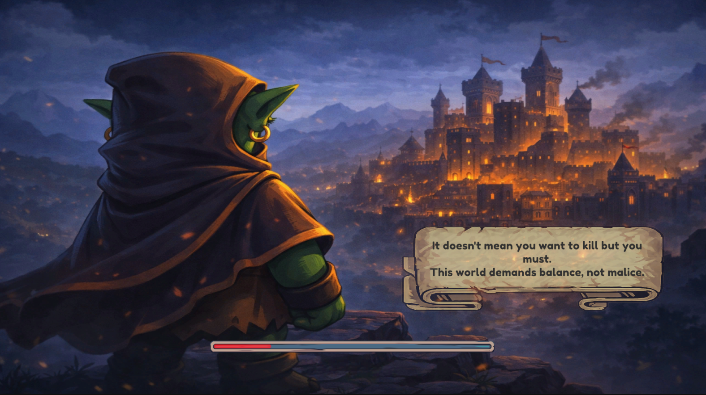
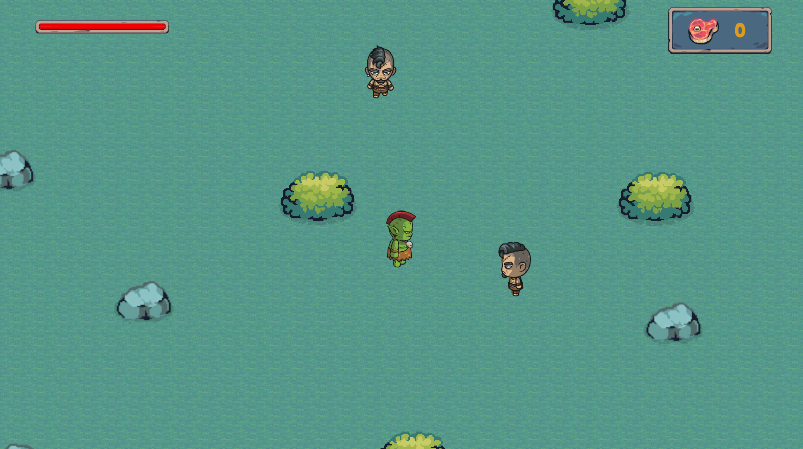
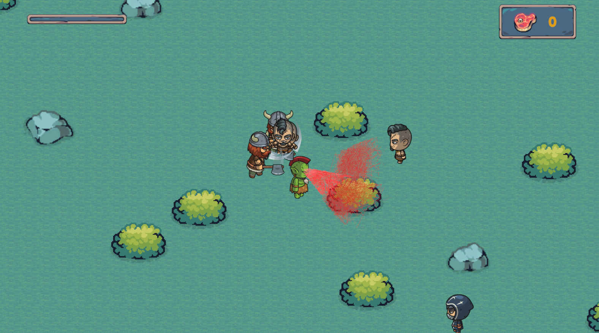

# BloodShot

**In BloodShot, every bullet you fire drains your life force. Balance aggression with survival as you fight through waves of enemies.**

**[Play Online on itch.io](https://auvro-islam.itch.io/bloodshot)** | **Download for Windows**

---

## About

BloodShot is a fast-paced action game where your ammunition is your life. Every shot you fire costs you health, forcing you to make tactical decisions in the heat of battle. Hunt down enemies, collect their souls to restore your vitality, and survive as long as you can.

## How to Play

| Control | Action |
|---------|--------|
| **WASD** | Move your character |
| **Mouse** | Aim |
| **Left Click** | Shoot (costs health!) |
| **ESC** | Pause game |

## Core Mechanic

Each shot you fire **costs you health**. This creates a unique risk-reward gameplay loop:

- **Shooting drains your life** - Every bullet fired takes away your health
- **Collect souls** - Defeated enemies drop souls that restore your life
- **Aim carefully** - Aimless firing leads to death
- **Balance aggression with survival** - Know when to fight and when to conserve

## Screenshots

## Installation

### Play Online
Simply visit **[https://auvro-islam.itch.io/bloodshot](https://auvro-islam.itch.io/bloodshot)** and click "Run game" to play directly in your browser.

### Download for Windows
1. Go to **[https://auvro-islam.itch.io/bloodshot](https://auvro-islam.itch.io/bloodshot)**
2. Click the **Download** button
3. Extract the downloaded ZIP file
4. Run `BloodShot.exe`

## Tips for Survival

- **Prioritize accuracy** - Missing shots wastes both bullets and health
- **Manage your health pool** - Keep track of how many shots you can afford
- **Hunt souls aggressively** - You need them to continue fighting
- **Control enemy waves** - Don't let yourself get overwhelmed
- **Every shot counts** - Make each one matter

## Built With

- Unity Game Engine
- C#

## License

All rights reserved.

---

**Enjoy BloodShot? Leave a rating on [itch.io](https://auvro-islam.itch.io/bloodshot)!**

Made for game jams

